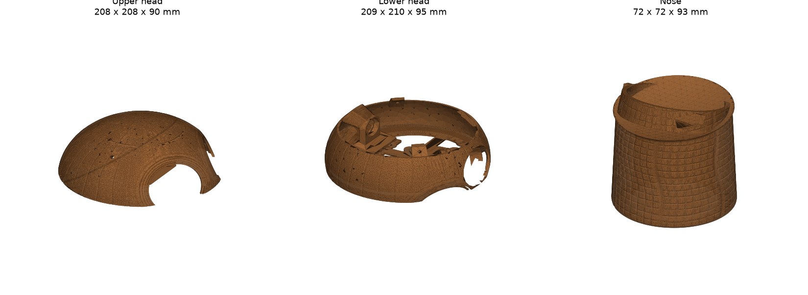

# Twiglet

**Twiglet** is a ~50 cm, 19-DoF 3D-printed biped with a wooden-ball head, two round digital eyes, a printed hair piece under a felt hat, a leaf kilt and two small arms with grippers. It is built on the open-source [Open Duck Mini v2](https://github.com/apirrone/Open_Duck_Mini/tree/v2) legs, neck and electronics.

[Hardware →](#hardware) · [BOM →](docs/BOM.md) · [Print →](docs/print_guide.md) · [Assemble →](docs/assembly_guide.md) · [Simulation →](experiments/README.md) · [Contribute →](CONTRIBUTING.md)

> **Status: simulation only.** Nothing has been printed or built yet, so every number below is from MuJoCo and mesh checks. Photos and videos of a real build are TODO.

| | | |
|:-:|:-:|:-:|
|  |  |  |
| **Complete, back view** | **Head + hair piece v3.44** | **Head shells and nose** |
|  |  |  |
| **Legs on the trunk** | **3-DoF arms (STS3032)** | **Head inside: Pi, eyes, ballast** |

## What's new compared with Open Duck Mini v2

- **Head:** a new wood-textured ball head (v3.30) with a hollow nose and two 2.1" round touch LCDs as eyes (ESP32-S3; firmware in [`experiments/twiglet_eyes/`](experiments/twiglet_eyes/README.md)), on the stock 3-servo neck.
- **Hair piece:** one printed piece (v3.44, 186 g at 4.5 % infill) that pins and keys onto the head; a felt hat goes over it.
- **Body:** a slim torso cone with a 10-petal leaf kilt, shin covers and boots (body v3.34, 50 STLs).
- **Arms:** two 3-DoF arms (shoulder, elbow, gripper) on Feetech STS3032 micro bus servos, powered from a 6 V buck regulator.
- **Simulation and checks:** MuJoCo model, open-loop gait parameters, standing, push and neck-load tests, plus collision and print-file checks on the real meshes. All of it runs from this repo.

## Hardware

| Category | Item | Specification |
|---|---|---|
| Body | Size | about 340 × 276 × 499 mm (feet to hair top, rest pose; hat not modelled) |
| Body | Mass (sim model) | 2.753 kg; head 0.814 kg including the 25 g ballast and the hair piece |
| Motion | Joints | 19: 10 legs + 3 neck (13 × Feetech STS3215), 6 arms (Feetech STS3032) |
| Computing | Main board | Raspberry Pi Zero 2W (as upstream) |
| Sensing | IMU | BNO055 (as upstream) |
| Interaction | Eyes | 2 × Waveshare ESP32-S3-Touch-LCD-2.1 (480 × 480 round), UART from the Pi |
| Power | Battery | 2S 18650 (2 cells) + 2S BMS; 5 V UBEC for logic and eyes; 6 V buck for the arm servos |
| Printing | Printer used for the checks | Bambu P1S (every part fits 256 × 256 × 256 mm), PLA / PETG / optional TPU |

Full parts list with links and prices: [docs/BOM.md](docs/BOM.md) (CSV: [docs/BOM.csv](docs/BOM.csv)). Several prices are still TODO.

## Simulation results

From [`experiments/`](experiments/README.md), model `experiments/twiglet_sim/models/twiglet_v3_v334_wig344.xml` (body v3.34 + head v3.30 + hair v3.44), re-run from this repo on 5 Oct 2026:

| check | result | pass criterion |
|---|---|---|
| standing margin (crouch 0.10) | 50.5 mm | no fall, > 30 mm |
| head + arm motion (e-margin) | 34.1 mm | ≥ 30 mm |
| neck-pitch static hold | 0.232 N·m = **2.11×** the STS3215 rating | ≥ 2× |
| main gait, 20 randomized trials | **19/20** at 0.206 m/s | ≥ 19/20 |
| main gait, 20 held-out seeds | 18/20 at 0.206 m/s | ≥ 18/20 |
| efficient gait, 20 randomized trials | **20/20** at 0.156 m/s | ≥ 19/20 |
| hair vs arms inside the soft limits | 0 / 0 / 0 (yaw 0 / −45 / +45) | 0 |
| 315-pose head range | 154/315 poses with any contact, 0 hair-only | ≤ ~154, 0 hair-only |
| eye coverage by the hair | 0 / 0 triangles | 0 |
| print files | watertight, 1 body, fit the P1S | all |

The gaits are 12-parameter open-loop/PD vectors ([BEST_WALK_PARAMS_v334r1.npy](BEST_WALK_PARAMS_v334r1.npy), [BEST_WALK_EFF_PARAMS_v333r1.npy](BEST_WALK_EFF_PARAMS_v333r1.npy); see `experiments/twiglet_sim/walk_search.py`), **not** ONNX RL policies like upstream's. Training a policy with [Open_Duck_Playground](https://github.com/apirrone/Open_Duck_Playground) is TODO.

## Where to find things

| Resource | Purpose |
|---|---|
| [docs/BOM.md](docs/BOM.md) | Parts list (upstream columns + our extra parts) |
| [docs/print_guide.md](docs/print_guide.md) | Which stock parts are still used, plus the print settings of every new part (some are **required**: the sims assume them) |
| [docs/assembly_guide.md](docs/assembly_guide.md) | 15-step build with rendered step images |
| [print/mods/Twiglet/](print/mods/Twiglet/README.md) | New STLs (print-oriented), Blender sources and build scripts |
| [mini_bdx/robots/twiglet_v334/](mini_bdx/robots/twiglet_v334/README.md) | MuJoCo model (MJCF + meshes) |
| [experiments/](experiments/README.md) | Every simulation and geometry check, how to run it, and the reference results |
| [docs/configure_motors.md](docs/configure_motors.md), [docs/sim2real.md](docs/sim2real.md), [docs/prepare_robot.md](docs/prepare_robot.md) | Servo IDs, sim-to-real notes, how the model was made |
| [docs/upstream/](docs/upstream/) | The upstream Open Duck Mini v2 docs, unchanged, for reference |

For the stock Open Duck Mini v2 parts use upstream's [Onshape CAD](https://cad.onshape.com/documents/64074dfcfa379b37d8a47762/w/3650ab4221e215a4f65eb7fe/e/0505c262d882183a25049d05) and [BOM](https://docs.google.com/spreadsheets/d/1gq4iWWHEJVgAA_eemkTEsshXqrYlFxXAPwO515KpCJc/edit?usp=sharing). The onboard runtime is upstream's [Open_Duck_Mini_Runtime](https://github.com/apirrone/Open_Duck_Mini_Runtime) (TODO: add the arm servos and the eye UART).

### Large files

Every file is under GitHub's 100 MB limit. Over 25 MB: `print/mods/Twiglet/source/blender/body_v334.blend` (59 MB). The head v3.30 `.blend` (194 MB) is not included; its rebuild scripts are in `print/mods/Twiglet/source/scripts/head_v3.30/`.

## Credits

This project stands on **[Open Duck Mini v2](https://github.com/apirrone/Open_Duck_Mini)** by Antoine Pirrone ([apirrone](https://github.com/apirrone)) and the Open Duck Mini contributors (see [thanks.md](thanks.md)), sponsored by HuggingFace and Pollen Robotics. Their legs, feet, neck, electronics, wiring diagrams and docs are used here under the Apache License 2.0; [NOTICE](NOTICE) lists exactly which files are theirs, unmodified or modified. Thanks also to Rhoban for [BAM](https://github.com/Rhoban/bam), and to the [MuJoCo](https://github.com/google-deepmind/mujoco), [trimesh](https://github.com/mikedh/trimesh), [PyVista](https://github.com/pyvista/pyvista) and [Blender](https://www.blender.org/) projects.

This project is not affiliated with or endorsed by Pollen Robotics, HuggingFace or the Open Duck Mini project.

## License

Copyright 2026 Mike Holborn (DreamMachina).

The new material in this repository is licensed under the [Apache License 2.0](LICENSE). The Open Duck Mini v2 material stays under its own Apache-2.0 terms and copyright; see [NOTICE](NOTICE). Contributions are accepted under the same licence (see [CONTRIBUTING.md](CONTRIBUTING.md)).
