# Assembly guide

> This is the Twiglet assembly guide. It follows the structure of the [Open Duck Mini v2 assembly guide](https://github.com/apirrone/Open_Duck_Mini/blob/v2/docs/assembly_guide.md) by apirrone and the Open Duck Mini contributors. The steps marked **(upstream)** are theirs, unchanged, and link to the original with its photos. A verbatim copy is in [upstream/assembly_guide.md](upstream/assembly_guide.md). The steps marked **(Twiglet)** are ours.
>
> **Nothing has been built yet.** Our steps come from the design notes (body v3.1–v3.34, head v2 / v3 digital eyes / v3.30, hair v3.44) and have not been checked on a real robot. Anything we don't know is marked **TODO**. Nothing here is guessed: if a screw length or a fixing isn't in our records, it says TODO.

> Before assembling the duck, you should first [configure your motors](./configure_motors.md)

**About the images.** The step images in `images/assembly/` are rendered from the v3.34 + wig v3.44 rest-pose measurement scene and from the print STLs, by [`experiments/twiglet_geom/render_assembly.py`](../experiments/twiglet_geom/render_assembly.py) (`python render_assembly.py`, about 15 s). Re-run it after any part change.
- In the exploded views, the parts of the step are in colour and the parts already fitted are a faint grey ghost.
- The scene is a simulation scene, not CAD. Servos, horns and bearings are simple dark-grey stand-ins. Anything labelled "(sim)" is a lumped mass (boards, battery, screws), **not** a printed part.
- The "parts" images show every print file of the step in its print orientation, labelled with its quantity. "2?" means the quantity is still a TODO.

<table>
  <tr>
    <td> 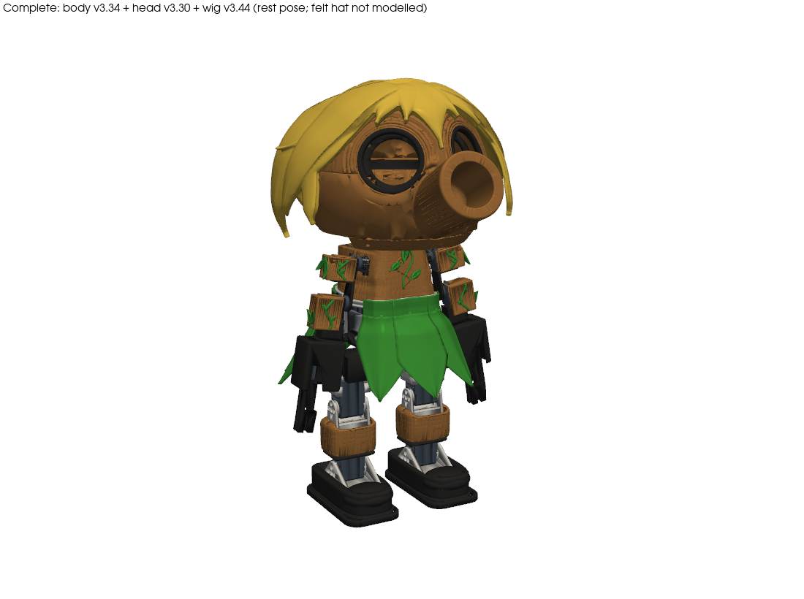</td>
    <td> 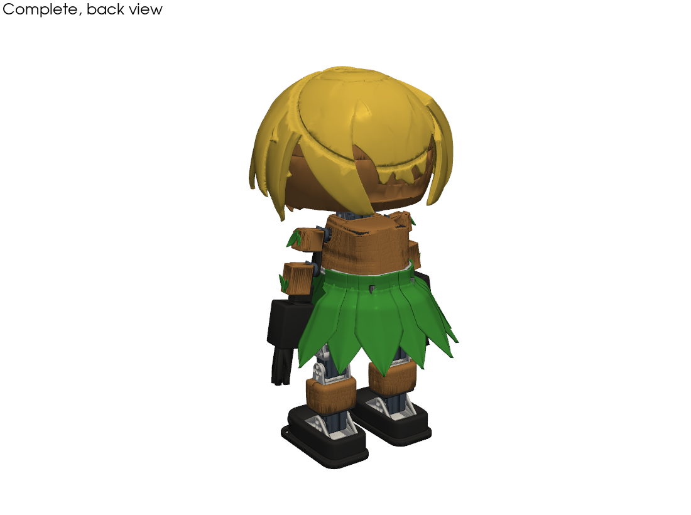</td>
   </tr> 
</table>

## Build order

| Step | What | Images |
|---|---|---|
| 0 | Print, configure the motors, fit the heat-set inserts | – |
| 1 | Feet + boots | `s01_feet`, `s01_feet_parts` |
| 2 | Shins + shin covers | `s02_shins`, `s02_shins_parts` |
| 3 | Thighs | `s03_thighs`, `s03_thighs_parts` |
| 4 | Hips | `s04_hips`, `s04_hips_parts` |
| 5 | Trunk: torso frame (battery tray) + hip cradle | `s05_trunk`, `s05_trunk_parts` |
| 6 | Legs on the trunk | `s06_legs_on_trunk` |
| 7 | Electronics: servo board, IMU, battery, 6 V arm branch, wiring | `s07_electronics` |
| 8 | Torso shells + chest leaves | `s08_torso_shells` |
| 9 | Arms + grippers | `s09_arms`, `s09_arms_parts` |
| 10 | Kilt band + petals | `s10_kilt`, `s10_kilt_parts` |
| 11 | Neck + head mechanism | `s11_neck`, `s11_neck_parts` |
| 12 | Head v3.30 inside: inserts, bearing, ballast, Pi, eyes, chin collars | `s12_head_inside`, `s12_head_parts` |
| 13 | Close the head: bezels, head_upper, snout | `s13_head_close` |
| 14 | Wig v3.44 + felt hat | `s14_wig`, `s14_wig_parts` |
| 15 | Final checks | `s15_complete_front/back` |

## Parts to step

Every print file and the step that uses it. Print settings are in [print_guide.md](print_guide.md) and the per-pack print sheets.

| Step | File | Qty | Colour | Where |
|---|---|---|---|---|
| 1 | `foot_top.stl` | 2 | stock | [print/](../print) (stock ODM v2) |
| 1 | `foot_side.stl` | 2 | stock | print/ |
| 1 | `foot_bottom_pla.stl` | 2 | stock | print/ |
| 1 | `foot_bottom_tpu.stl` | 2 | TPU | print/ |
| 1 | `v332_boot_L.stl`, `v332_boot_R.stl` | 1 + 1 | black (PETG/TPU 95A, PLA ok) | [body_v3.34](../print/mods/Twiglet/body_v3.34) |
| 1 | `v39_boot_cuff.stl` | 2 | black | body_v3.34 |
| 2 | `knee_to_ankle_left_sheet.stl` | TODO (the scene has 1 per shin, so 2) | stock | print/ |
| 2 | `knee_to_ankle_right_sheet.stl` | TODO (1 per shin in the scene, so 2) | stock | print/ |
| 2 | `leg_spacer.stl` | TODO (1 per shin in the scene, so 2) | stock | print/ |
| 2 | `v332_shin_cover_front_L/R.stl`, `v332_shin_cover_back_L/R.stl` | 4 | wood-brown | body_v3.34 |
| 3 | `v39_thigh_sheet_a.stl` | 2 | black | body_v3.34 |
| 3 | `v331_thigh_sheet_b.stl` | 2 | black | body_v3.34 |
| 3 | `v39_thigh_spacer.stl` | 2 | black | body_v3.34 |
| 4 | `roll_motor_top.stl` | 2 | stock | print/ |
| 4 | `roll_motor_bottom.stl` | 2 | stock | print/ |
| 4 | `v39_hip_bracket_L.stl`, `v39_hip_bracket_R.stl` | 1 + 1 | black PETG/PLA+ (load path) | body_v3.34 |
| 5 | `v331_torso_frame.stl` | 1 | any (hidden), PLA+/PETG | body_v3.34 |
| 5 | `v39_hip_cradle.stl` | 1 | any (hidden) | body_v3.34 |
| 8 | `v331_torso_shell_front.stl`, `v331_torso_shell_back.stl` | 1 + 1 | wood-brown | body_v3.34 |
| 8 | `v332_chest_vine.stl` | 1 | green | body_v3.34 |
| 8 | `v39_leaf_M.stl` (chest) | 1 | green | body_v3.34 |
| 8 | `v39_leaf_S.stl` (vine) | 2 | green | body_v3.34 |
| 9 | `v333_shoulder_sleeve_L/R.stl` | 1 + 1 | wood-brown | body_v3.34 |
| 9 | `v39_upper_arm_L/R.stl` | 1 + 1 | black | body_v3.34 |
| 9 | `v333_elbow_sleeve_L/R.stl` | 1 + 1 | wood-brown | body_v3.34 |
| 9 | `v39_forearm_L/R.stl` | 1 + 1 | black | body_v3.34 |
| 9 | `v334_gripper_housing_L/R.stl` | 1 + 1 | black | body_v3.34 |
| 9 | `v333_finger_moving_L/R.stl` | 1 + 1 | black | body_v3.34 |
| 9 | `v333_leaf_shoulder_L/R.stl`, `v333_leaf_elbow_L/R.stl` | 4 | green | body_v3.34 |
| 9 | `v333_vine_upper_L/R.stl`, `v333_vine_fore_L/R.stl` | 4 | green | body_v3.34 |
| 10 | `v331_kilt_band.stl` | 1 | green | body_v3.34 |
| 10 | `v334_kilt_petal_00.stl` … `v334_kilt_petal_09.stl` | 10 (1 each) | green PLA (or TPU 95A) | body_v3.34 |
| 11 | `head_pitch_to_yaw.stl` | 1 | stock | print/ |
| 11 | `head_roll_mount.stl` | 1 | stock | print/ |
| 11 | `v330_head_head_yaw_to_roll.stl` | 1 | any | [head_v3.30](../print/mods/Twiglet/head_v3.30) |
| 12 | `v330_head_head_lower.stl` | 1 | wood-brown PETG | head_v3.30 |
| 12 | `v330_head_display_carrier_L/R.stl` | 1 + 1 | matte black | head_v3.30 |
| 12 | `v330_head_chin_collar_L/R.stl` | 1 + 1 | wood-brown | head_v3.30 |
| 13 | `v330_head_eye_bezel_L/R.stl` | 1 + 1 | matte black | head_v3.30 |
| 13 | `v330_head_head_upper.stl` | 1 | wood-brown PETG | head_v3.30 |
| 13 | `v330_head_snout.stl` | 1 | wood-brown | head_v3.30 |
| 14 | `FINAL_WIG.stl` | 1 | yellow/blond PLA (186.2 g) | [wig_v3.44](../print/mods/Twiglet/wig_v3.44) |

That is all 50 body v3.34 files, all 10 head v3.30 files and the wig.

**Stock files we don't print:** `trunk_bottom`, `trunk_top`, `body_front`, `body_middle_bottom`, `body_middle_top`, `body_back` (replaced by the torso frame and shells); `head`, `head_bot_sheet`, `head_yaw_to_roll` (replaced by head v3.30); `left_eye`, `right_eye`, `left/right_antenna_holder` (replaced by the digital eyes; no antennas); `neck_left_sheet`, `neck_right_sheet` (no neck-pitch servo since v3.5); `battery_pack_lid` (the battery goes in the frame tray).
- TODO: `left_roll_to_pitch` / `right_roll_to_pitch`. In our sim scene the roll-to-pitch link carries only the servo and its horns, with no printed part, and `v39_hip_bracket_L/R` sits on the hip-roll link. Confirm whether the stock parts are still needed.
- TODO: `left_cache` / `right_cache`, `speaker_interface`, `speaker_stand`, `bulb`, `flash_light_module`, `flash_reflector_interface`. Our records don't use them (no projector LEDs, speaker undecided).

## Requirements : 

You will need : 
- A soldering iron, and basic electronics tools and skills
- X m3 screws (TODO : add the exact number). Known so far:
  - 4× M3×8 for the chin collars
  - 4× M3×8 for the display carriers
  - 4× M3 for the head halves (length TODO)
  - plus the upstream leg/neck screws
- 8× M2×5 pan/button-head screws (displays to carriers)
- M2 screws for the upper-arm plates (count and length TODO)
- M3 heat-set inserts. Known so far:
  - 4× M3×5×4 for the chin collars
  - 4× M3×4×5 (Ø4 hole) for the display carriers
  - 4× for the head halves
  - plus upstream's
- 6× Feetech STS3032 (C001) arm servos and a 6 V buck regulator (for example Pololu D36V50F6) for them
- 2× Waveshare ESP32-S3-Touch-LCD-2.1 round displays, 2× SH1.0 12-pin cables (~150 mm), a 4-pin inline connector and ~30 cm of 26 AWG wire
- The 20×32×7 head roll bearing (stock size)
- Some wire, and zip ties
- Loctite Threadlocker blue 243
- 2-part epoxy (5- or 30-min) and medium CA glue
- 25 g of steel ballast for the head (for example 5× M8 hex nuts)
- 4× 3 mm steel rods or PLA filament, 12 mm long (wig pins)
- A felt hat (fabric, not printed)

> General note : Everytime you screw something in the motors metal against metal, you want to use a little loctite threadlocker. This will prevent the screws from coming loose due to the vibrations during the operation of the robot. It adds a little time to to the build, but you'll be glad you took the time ;)
>
> Don't use loctite with the plastic screws

> For the stock parts, you can refer to the upstream CAD at any time: https://cad.onshape.com/documents/64074dfcfa379b37d8a47762/w/3650ab4221e215a4f65eb7fe/e/0505c262d882183a25049d05
>
> Our parts have no Onshape CAD. Use the Blender sources in `print/mods/Twiglet/source/` and the images below.

## Steps :

### 0. Before you start

1. Print everything in the [parts table](#parts-to-step). Settings are in [print_guide.md](print_guide.md).
2. Configure every servo ID first ([configure_motors.md](configure_motors.md)). TODO: the IDs for the 6 arm servos.
3. Fit the heat-set inserts while the parts are loose: the stock ones from upstream, then the head ones (step 12).

### 1. Assemble the feet

<table>
  <tr>
    <td> 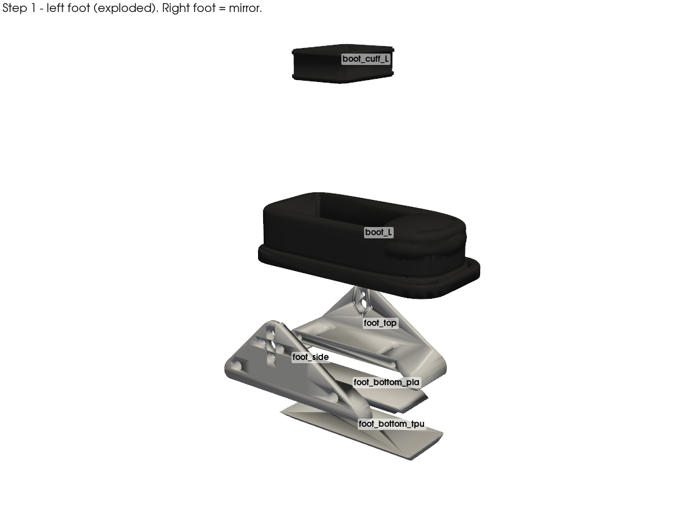</td>
    <td> 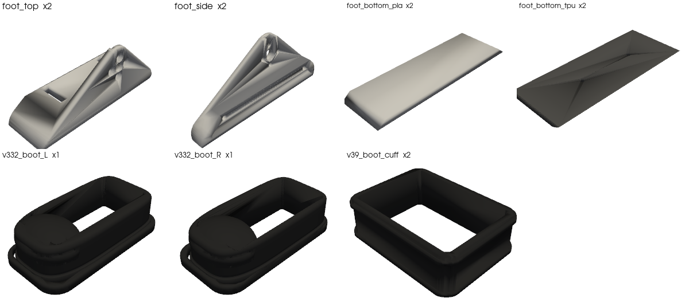</td>
   </tr> 
</table>

**(upstream)** Unchanged: `foot_bottom_tpu` + `foot_bottom_pla` (2× M3×6 into inserts), then `foot_top` with the ankle motor. See [Assemble the feet](https://github.com/apirrone/Open_Duck_Mini/blob/v2/docs/assembly_guide.md#assemble-the-feet).

**(Twiglet)**
1. Fit the black `v332_boot_L/R` shell over the finished stock foot. TODO: how the boot is held (press fit or glue).
2. Slip `v39_boot_cuff` over the top of the stock foot.

- TODO: whether we fit the SS-10 foot switches. The sim does not model them.

### 2. Assemble the shins

<table>
  <tr>
    <td> 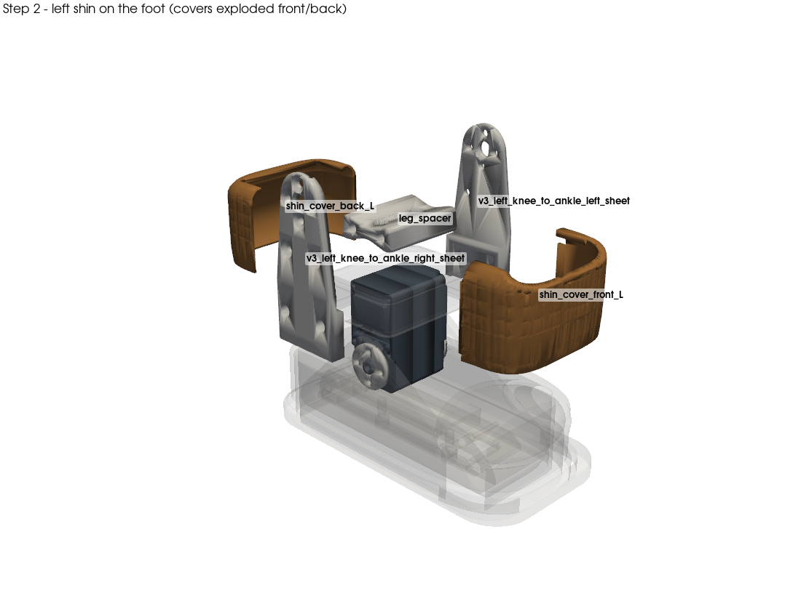</td>
    <td> 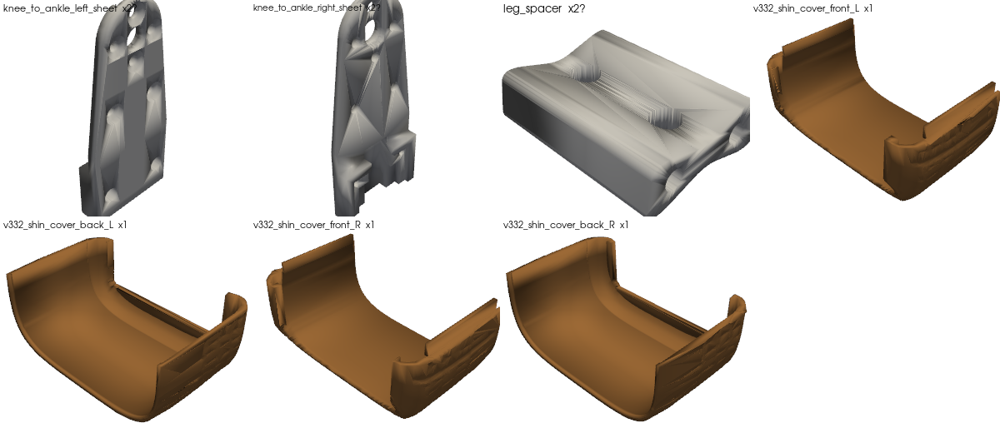</td>
   </tr> 
</table>

**(upstream)** Unchanged: `leg_spacer` with M3 inserts and the stock knee-to-ankle sheets. See [Assemble the shins](https://github.com/apirrone/Open_Duck_Mini/blob/v2/docs/assembly_guide.md#assemble-the-shins).

**(Twiglet)** The wood-brown `v332_shin_cover_front/back_L/R` clamshell goes over the shin sheets, between the knee servo and the boot cuff:
1. Fit the back half behind the shin sheets.
2. Fit the front half. Its 1 mm lap lip keys into the back half.
3. Glue the halves to each other around the shin.

The shin-cover fit is from the v3.8 note. TODO: confirm it on the v3.32 covers.

### 3. Assemble the thighs 

<table>
  <tr>
    <td> 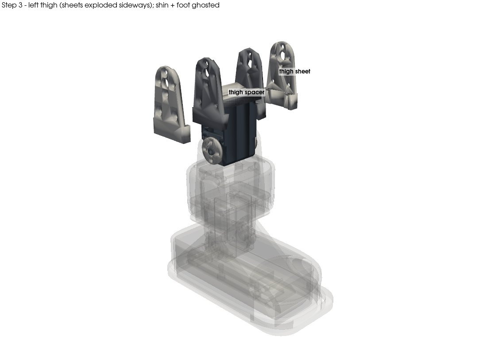</td>
    <td> 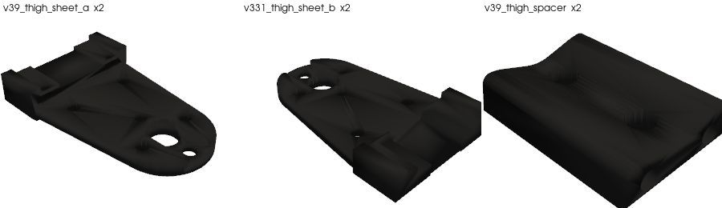</td>
   </tr> 
</table>

**(upstream)** Same motor orientation as upstream (important for the zero position). See [Assemble the thighs](https://github.com/apirrone/Open_Duck_Mini/blob/v2/docs/assembly_guide.md#assemble-the-thighs).

**(Twiglet)** Our thigh is 22 mm shorter than stock (v3.1). It uses the black `v39_thigh_sheet_a` ×2, `v331_thigh_sheet_b` ×2 and `v39_thigh_spacer` ×2 instead of the stock sheets and spacer.
- TODO: the screw list.
- TODO: which sheet goes on which side.

### 4. Assemble the hips

<table>
  <tr>
    <td> 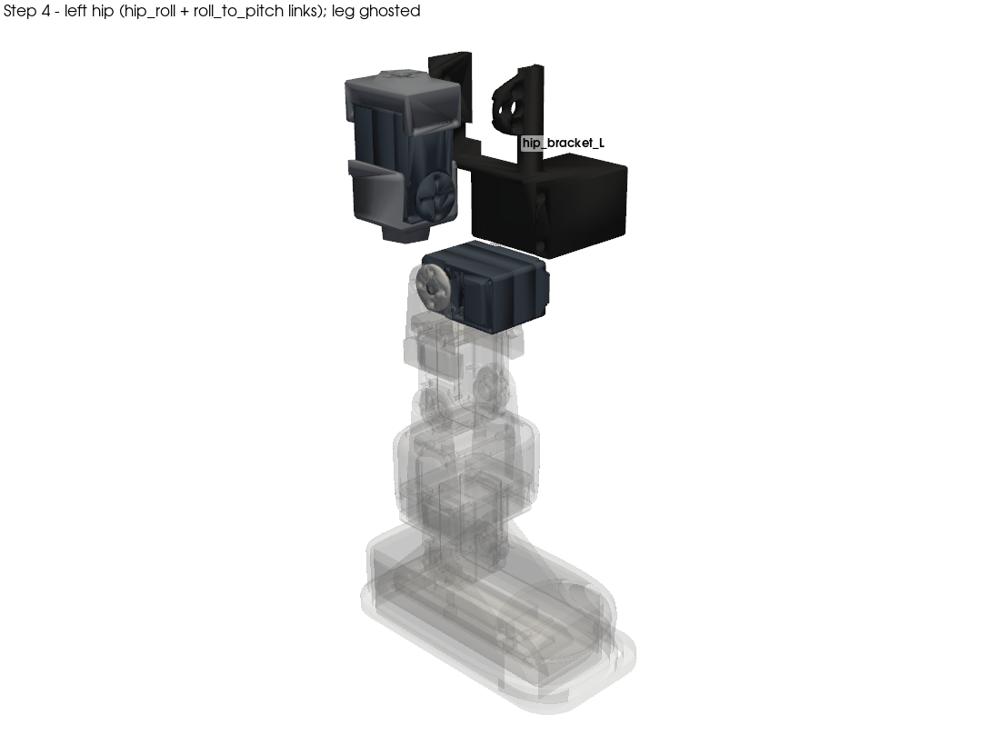</td>
    <td> 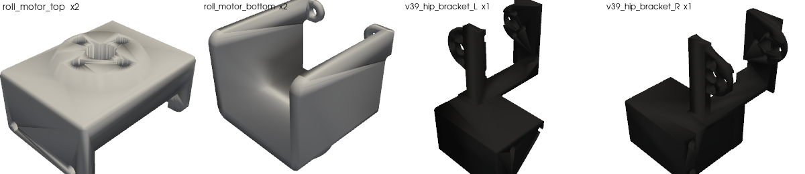</td>
   </tr> 
</table>

**(upstream)** `roll_motor_top` to the hip_yaw servo, then hip_roll and the sub-assembly. See [Assemble the hips](https://github.com/apirrone/Open_Duck_Mini/blob/v2/docs/assembly_guide.md#assemble-the-hips).

**(Twiglet)** The black `v39_hip_bracket_L/R` are the load-path hip parts. They print like the stock `*_roll_to_pitch` (sleeve axis vertical).
- In the sim scene each bracket sits on the hip-roll link, next to the hip-roll servo.
- TODO: confirm that they replace `left/right_roll_to_pitch`, and give the mounting screws.

### 5. Assemble the trunk

<table>
  <tr>
    <td> 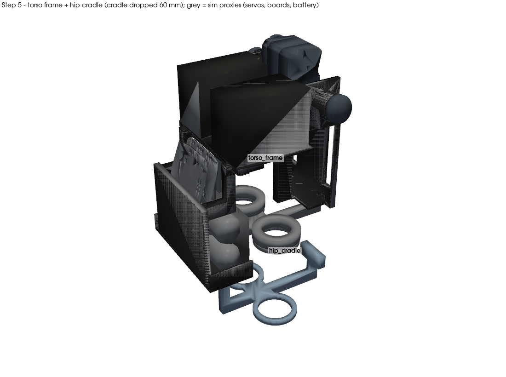</td>
    <td> 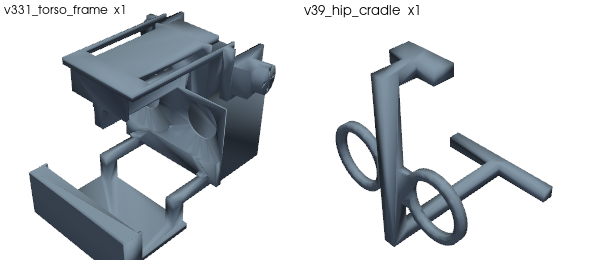</td>
   </tr> 
</table>

**(Twiglet)** We do **not** use `trunk_bottom` / `trunk_top`. Our trunk is made of:
- `v331_torso_frame`: battery tray, back rail, hip deck, the two strut columns, the fixed neck post with the head-pitch cup cradle, and the shoulder bosses. Since v3.5 there is no neck-pitch servo.
- `v39_hip_cradle` (hidden; printed flipped, seats up, with T-arms). TODO: exactly what it carries and how it attaches to the frame.

The `roll_motor_bottom` parts are still the stock ones. The hips are 20 mm further forward than stock and the battery further back (v3.1), and the legs are 100 mm apart.

- TODO: the exact trunk steps. How the hip-yaw servos and `roll_motor_bottom` mount on the hip cradle and frame, which screws, which inserts, and whether the stock trunk bearings are still used.
- Upstream step for reference: [Assemble the trunk](https://github.com/apirrone/Open_Duck_Mini/blob/v2/docs/assembly_guide.md#assemble-the-trunk).

### 6. Mount the legs on the trunk

<table>
  <tr>
    <td> 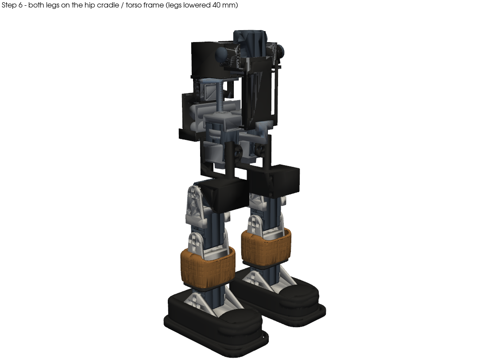</td>
   </tr> 
</table>

**(Twiglet)** Mount both finished legs (from the hip-yaw servo down) on the hip cradle / torso frame, 100 mm apart. Upstream equivalent: the end of [Assemble the hips](https://github.com/apirrone/Open_Duck_Mini/blob/v2/docs/assembly_guide.md#assemble-the-hips). TODO: the exact interface and fasteners.

### 7. Electronics

<table>
  <tr>
    <td> 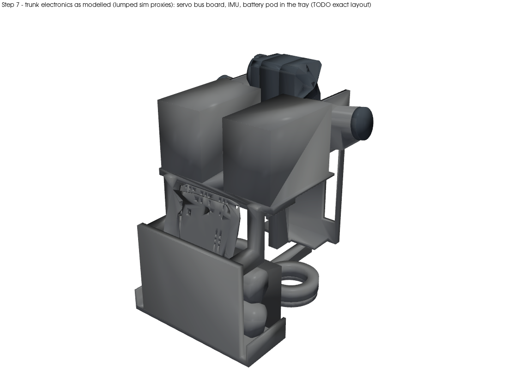</td>
   </tr> 
</table>

The image only shows where the sim puts the masses. The real layout is a TODO.

#### Mount the servo driver board

**(upstream)** TODO take a photo

**(Twiglet)** The Waveshare bus servo adapter is the same as upstream. TODO: where it mounts in our torso.

#### Mount the IMU

**(upstream)** BNO055, same as upstream. See [Mount the IMU](https://github.com/apirrone/Open_Duck_Mini/blob/v2/docs/assembly_guide.md#mount-the-imu). Mounting it in its natural orientation is better, and the orientation can be configured later.

**(Twiglet)** TODO: where the IMU mounts on `v331_torso_frame`.

#### Arm power

The STS3032 maximum is 7.4 V and a full 2S pack is 8.4 V. **Feed the arm branch through a 6 V buck regulator** (for example Pololu D36V50F6, 6 V 5.5 A). Share the data line and ground with the STS3215 bus. TODO: where the buck mounts.

#### Wiring

Here is the upstream global electronics schematic for reference. Ours is the same, plus the arm 6 V branch and the eye screens. TODO: an updated diagram.

<table>
  <tr>
    <td> 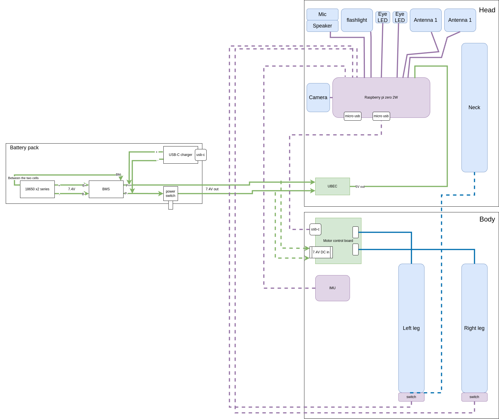</td>
    <td> 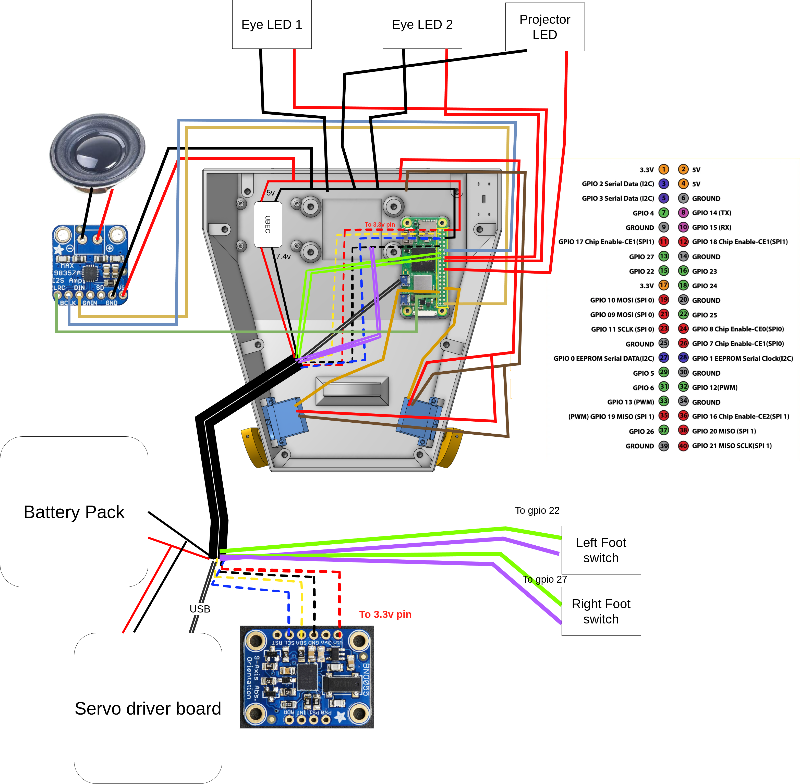</td>
   </tr> 
</table>

For the feet wiring, see [upstream](https://github.com/apirrone/Open_Duck_Mini/blob/v2/docs/assembly_guide.md#electronics) (only if the foot switches are fitted, TODO).

Here is the pin mapping on the Pi Zero header. It is upstream's mapping minus the parts we don't use, plus the eyes.

|       **Eyes (UART)**      | **Pi Zero Header Pin** | **Pi Zero Function** |
|:-------------------:|:----------------------:|:--------------------:|
|  L + R board RXD (12-pin #10) |           8           |   GPIO 14 (TXD)     |
|  L board TXD (12-pin #9)      |           10          |   GPIO 15 (RXD)     |
|  GND (12-pin #1)              |            6          |          GND        |
|  VBus 5V (12-pin #2)          |       5 V rail        |          5V         |
|                     |                        |                      |
|  **Foot Switches** (TODO: fitted?) |                        |                      |
|      Left Foot      |           15           |        GPIO 22       |
|      Right Foot     |           13           |        GPIO 27       |
|         GND         |            9           |          GND         |
|                     |                        |                      |
|      **BNO055**     |                        |                      |
|         VIN         |            1           |          3V3         |
|         3VO         |           NC           |           -          |
|         GND         |            9           |          GND         |
|         SDA         |            3           |        GPIO 2        |
|         SCL         |            5           |        GPIO 3        |
|         RST         |           NC           |           -          |

- Not used:
  - the eye/projector LEDs (pins 16/18/22)
  - the antenna PWM servos (pins 32/33). The 2 SG90 antenna servos are omitted.
- TODO: whether we keep the MAX98357A speaker (pins 35/12/40).
- Eye UART setup on the Pi:
  - `raspi-config` → Serial: login shell **no**, hardware **yes**.
  - Add `dtoverlay=disable-bt` to `/boot/firmware/config.txt`.
  - The servo bus runs over USB, so the GPIO UART is free.
  - Unplug the eye board's "UART" USB-C while the Pi drives it.
- Budget 0.5 A on the 5 V rail for the two eye boards. Their draw is not measured.

#### Battery pack

> To be safe, make sure your cells are charged to the same voltage before placing them in the holder.

**(upstream)** Same 2× 18650, holder, 2S BMS, charger and switch. See [Battery pack](https://github.com/apirrone/Open_Duck_Mini/blob/v2/docs/assembly_guide.md#battery-pack).

**(Twiglet)** The battery pod sits in the `v331_torso_frame` battery tray, behind the hips and under the kilt. It was moved 18 mm back and 7 mm lower than stock (v3) as a counterweight, and the sims assume it is there. Upstream's `battery_pack_lid` is not used. TODO: how the pack is held in the tray.

### 8. Fit the torso shells and chest leaves

<table>
  <tr>
    <td> 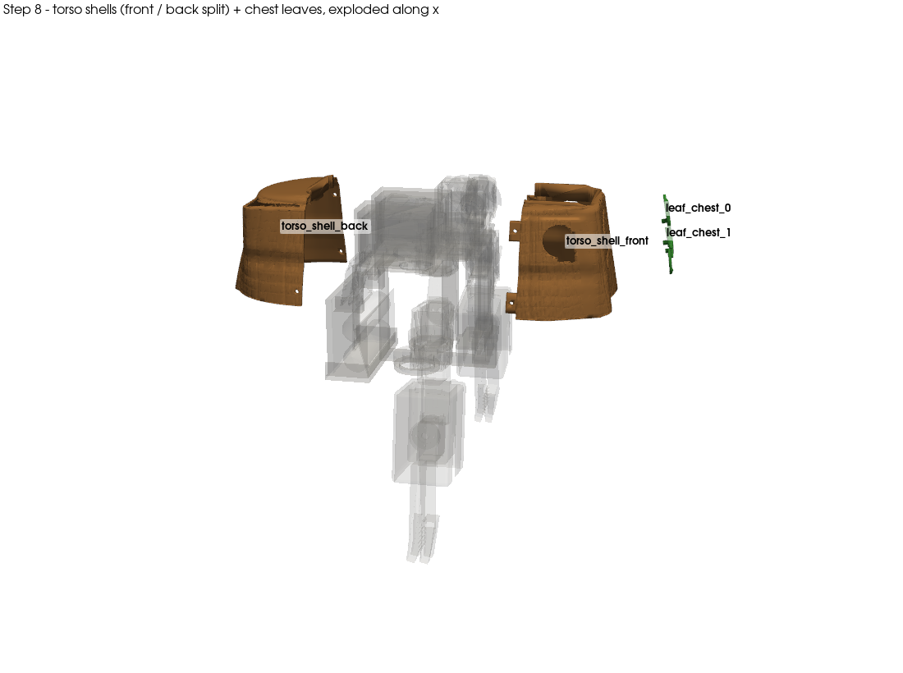</td>
   </tr> 
</table>

**(Twiglet)** This replaces upstream's `body_front`, `body_middle_bottom`, `body_middle_top` and `body_back`.
1. Fit `v331_torso_shell_back` and `v331_torso_shell_front` around `v331_torso_frame`. The shell is split front/back at x = −20 mm with tabs, and has a closed 2 mm top lid. TODO: fasteners.
   - The front shell has two shoulder-boss holes. TODO: confirm whether the shells must go on before the shoulder servos (step 9) or can go on after.
2. Glue `v332_chest_vine` and the leaves `v39_leaf_M` ×1 / `v39_leaf_S` ×2 (veined face out, peg into the socket) onto the front shell.

### 9. Assemble the arms

<table>
  <tr>
    <td> 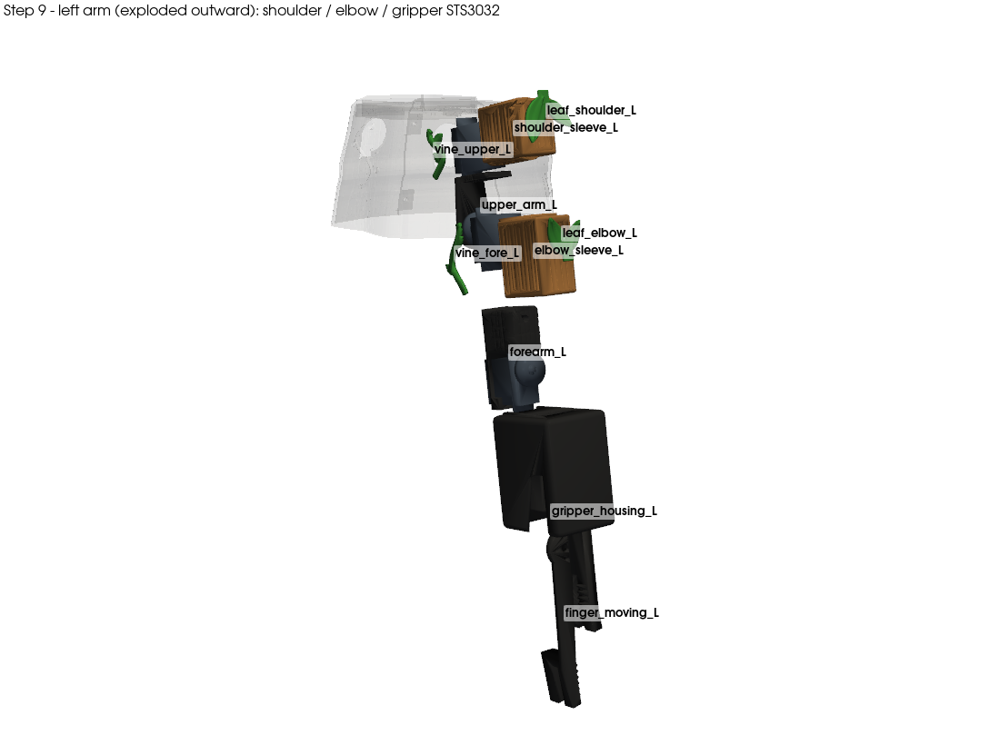</td>
    <td> 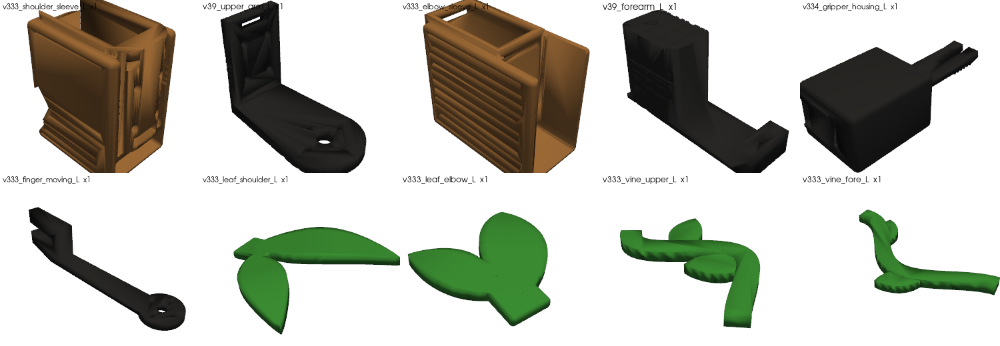</td>
   </tr> 
</table>

**(Twiglet)** This step is new. Each arm has 3 Feetech **STS3032** (C001) micro bus servos: shoulder pitch, elbow and gripper. They are on the same TTL bus as the STS3215s, on the 6 V branch (step 7). The elbow servo is flipped: its horn faces inward, so the black upper-arm plate runs down the inner side (v3.1).

Parts per side:
- `v333_shoulder_sleeve` and `v333_elbow_sleeve` (wood-brown blocks)
- `v39_upper_arm` and `v39_forearm` (black brackets)
- `v334_gripper_housing` (black, 36×47×57 mm, 1.6 mm walls, open bottom)
- `v333_finger_moving` (black, on the gripper servo horn)
- `v333_leaf_shoulder`, `v333_leaf_elbow`, `v333_vine_upper` and `v333_vine_fore` (green)

Steps:
1. Fix the shoulder servo to the shoulder boss on `v331_torso_frame` and slide on the shoulder sleeve. TODO: screws.
2. Fix `v39_upper_arm` with M2 screws to the sleeve bottom and the servo ears. This is from the v3.1/v3.8 notes: TODO confirm it on the v3.33 sleeves, and give the screw length and count.
3. Fit the elbow servo, the elbow sleeve and `v39_forearm`. TODO: screws.
4. Slide the gripper housing over the gripper servo (press-fit sleeve; the fit check gives the same overlap as rev C), then mount `finger_moving` on the horn. TODO: confirm that the fixed finger (prong) is part of the housing. There is no separate STL for it.
5. Glue the vines on the front faces of the upper-arm and forearm blocks. Glue the leaves into their sockets.

TODO: the arm servo IDs (see [configure_motors.md](configure_motors.md)).

Check: at rest the elbows rest against the kilt band, in its arm slots (step 10). The sim arm sweeps are clear of the shell, kilt and head inside the soft limits ([experiments/twiglet_geom](../experiments/twiglet_geom)).

### 10. Fit the kilt

<table>
  <tr>
    <td> 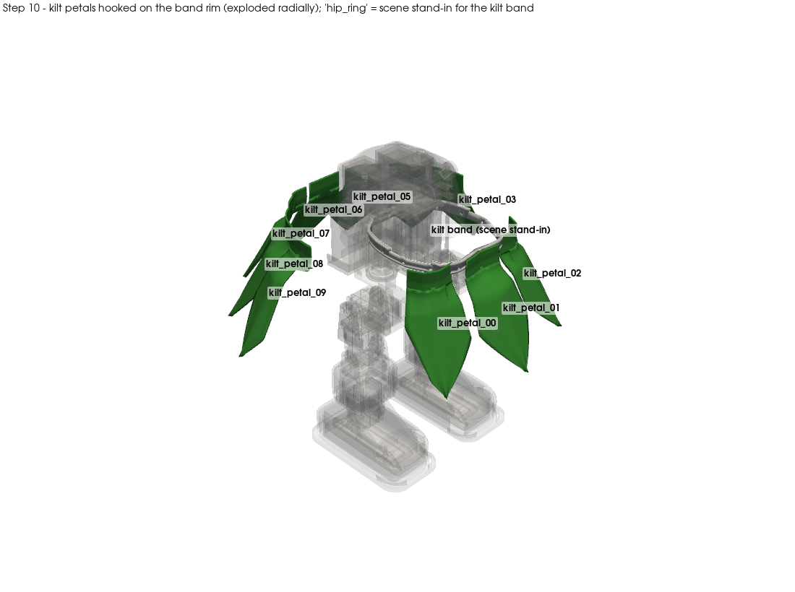</td>
    <td> 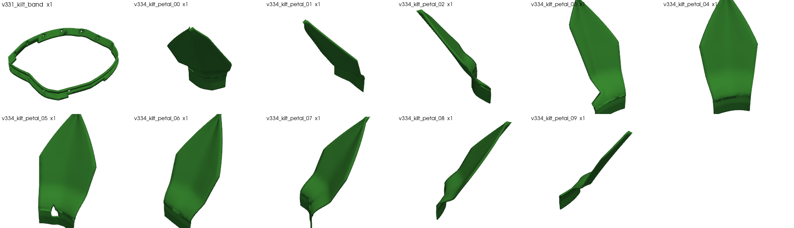</td>
   </tr> 
</table>

**(Twiglet)**
1. Fit the green `v331_kilt_band` at the hips. It is the v3 hip ring reprinted with a rolled rim on top, with arm slots at 46–93° either side for the elbows. TODO: how the band is fixed to the trunk.
2. Hook the 10 `v334_kilt_petal_00..09` over the band rim. Each petal's top lip hooks over the rim like a hinge and rests against the rim face, so the petals swing freely (the front petals can be pushed out by the feet at extreme knee + thigh angles; that's intended). Petals 00–02 are the front ones.
   - TPU petals don't swing; they flex and can be glued straight onto the rim.
   - TODO: whether the PLA petals need any retention.

### 11. Assemble the neck and head mechanism

<table>
  <tr>
    <td> 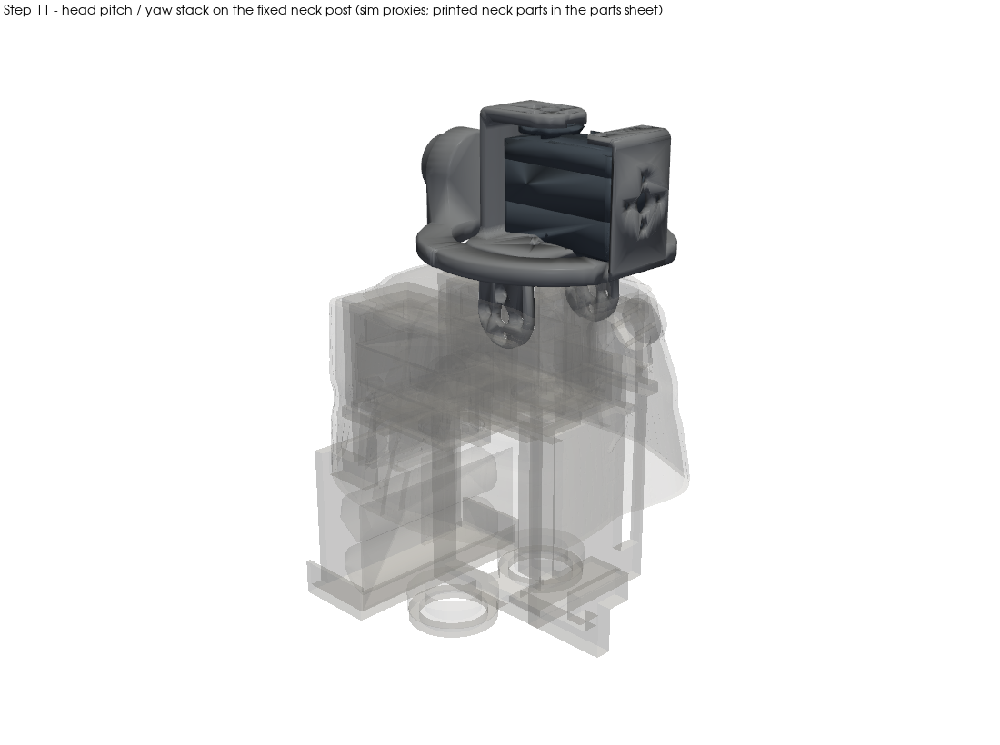</td>
    <td> 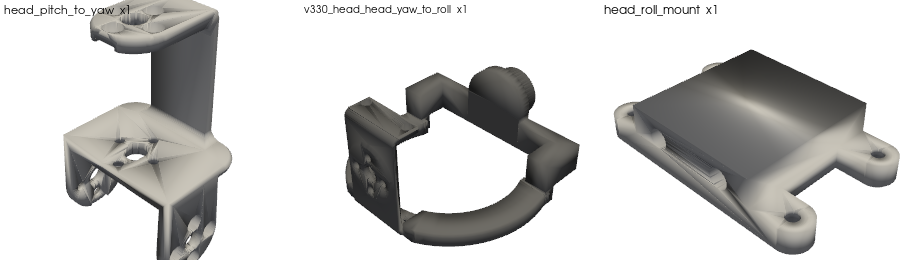</td>
   </tr> 
</table>

**(Twiglet)** There are no neck sheets and no neck-pitch servo (removed in v3.5). The head-pitch servo hangs below its axis and is bolted into the fixed head-pitch cup cradle on `v331_torso_frame`. TODO: the mounting screws. The upstream neck step ([Assemble the neck](https://github.com/apirrone/Open_Duck_Mini/blob/v2/docs/assembly_guide.md#assemble-the-neck)) does not apply.

**(upstream)** First, mount `head_pitch_to_yaw` (stock). Then, independently, mount the yaw-to-roll part and `head_roll_mount` (stock) to the head_roll dof, in the same order as [Assemble the head mechanism](https://github.com/apirrone/Open_Duck_Mini/blob/v2/docs/assembly_guide.md#assemble-the-head-mechanism).

**(Twiglet)** Print and use `v330_head_head_yaw_to_roll` **instead of** the stock `head_yaw_to_roll` and the older `v39_head_yaw_to_roll`.
- The roll bearing is the same 20×32×7 bearing, but it now presses into the housing in `v330_head_head_lower`, 12.1 mm further forward on the same roll axis (step 12).
- The new hub slides 7 mm into the bearing.
- Route the head cable down the **side** of the neck, not the back. In head v2 the radial gap at the collar opening was 17–29 mm at the sides and ~0 at the back (TODO: re-check on v3.30).

### 12. Head v3.30: inside head_lower

<table>
  <tr>
    <td> 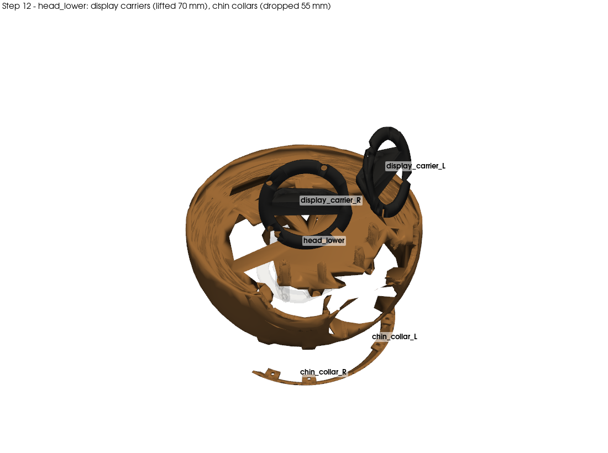</td>
    <td> 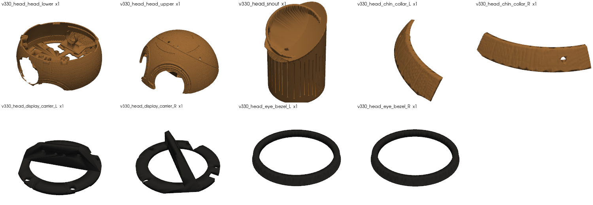</td>
   </tr> 
</table>

**(Twiglet)** This replaces upstream's `head.stl` and `head_bot_sheet`. Work with the head upside down on the bench.

1. **Inserts:**
   - 4 for the head-half joint
   - 4× M3×5×4, pressed vertically from below into the 4 bosses inside the `head_lower` rim, for the chin collars
   - 4× M3×4×5 in the `head_lower` deck posts, for the display carriers
2. **Bearing:** press the 20×32×7 roll bearing into the `head_lower` housing. The outer ring shows through the housing's bottom window; that is intended (a 282° wrap and a rear lip hold it).
3. **Ballast (required):** epoxy 25 g of steel on the ledge inside the back of `head_lower`, against the shell, centred on the rear centreline within ±30°. For example, use 5× M8 hex nuts standing on edge, or 5× 5 g wheel weights cut to 14 mm tall or less. Weigh it: it must be 23–27 g. The sims assume exactly this (head-pitch hold ≥ 2×; without it the hold drops to 1.9×).
4. **Pi Zero 2W:** on its standoffs in `head_lower` (head v2/v3 note: 3 screws go straight in, the 4th needs a ~20° tilted driver; 4× M2.5). The left display ends 0.6 mm from the Pi in the head v3 check. TODO: confirm the Pi mounting on v3.30.
   - The head v2 notes also put "the relocated ODM board" on top of the deck with 4× M2.5. TODO: confirm which board and whether that still applies.
5. **Eyes** (from the head v3 digital-eyes notes; TODO confirm on v3.30):
   1. Fix each Waveshare ESP32-S3-Touch-LCD-2.1 to its `display_carrier` with 4× M2×5 through the carrier ring into the board's standoffs. The carrier notch goes over the 12-pin header.
   2. Plug in the 12-pin cable.
   3. Drop each pod straight down into `head_lower`: the glass sits in its socket and the foot plate on the two posts. Fit 2× M3×8 from above into the deck-post inserts.
   4. Run the cables through the cable exit and along the deck to the Pi. Zip-tie them through the carrier slots.
   - Firmware and first-time setup (`SIDE`, `ROT`, `CENTER`, `SAVE`) are in [experiments/twiglet_eyes](../experiments/twiglet_eyes).
6. **Mount the head** on the neck: the hub of `v330_head_head_yaw_to_roll` slides 7 mm into the bearing, and `head_lower` fixes to the stock `head_roll_mount`. Head v2 used 4× M3, vertically from below, into the copied roll-mount bosses. TODO: confirm on v3.30. Upstream: [Head](https://github.com/apirrone/Open_Duck_Mini/blob/v2/docs/assembly_guide.md#head).
7. **Chin collars:** fix each collar with 2× M3×8 from below, through its 2 inner ledges, into the rim inserts (4 screws in total).

### 13. Close the head

<table>
  <tr>
    <td> 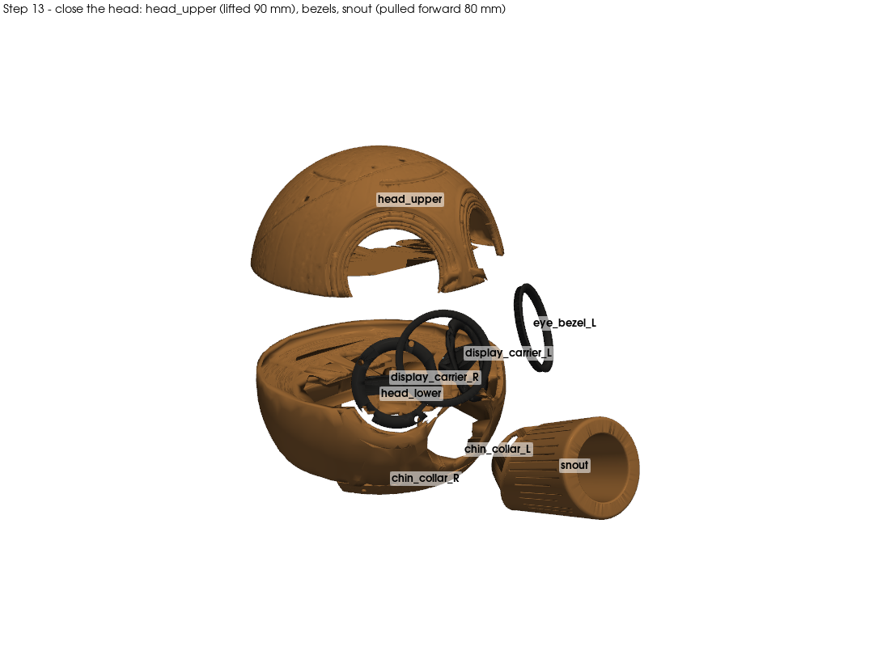</td>
   </tr> 
</table>

1. **Bezels:** glue the black `eye_bezel_L/R` into `head_upper`'s eye openings (CA or epoxy), flat face out, 0.8 mm proud. An optional foam ring goes on the bezel's back. (Head v3 digital-eyes note; TODO confirm on v3.30.)
2. **Close:** lower `head_upper` straight down over the eye pods onto `head_lower`, then fit 4 M3 screws from below into the inserts (length TODO; head v2 used a ball-end hex at ~15°).
3. **Snout:** dry-fit it so the key tab sits in the `head_lower` key slot and the root lies flush on the ball, then glue it (CA or epoxy). **Glue it to head_lower only.** head_upper still lifts straight off with the snout glued in.

**Service:** head_upper lifts straight up (with the bezels and the wig). Then undo 2× M3, lift a pod straight out, and undo its 4× M2 on the bench.

### 14. Wig and hat

<table>
  <tr>
    <td> 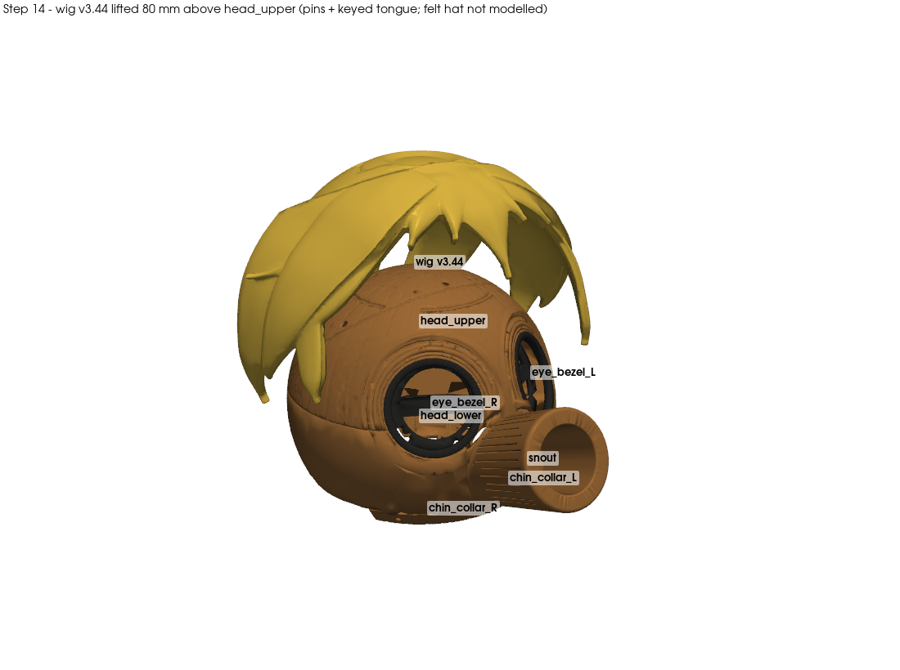</td>
    <td> 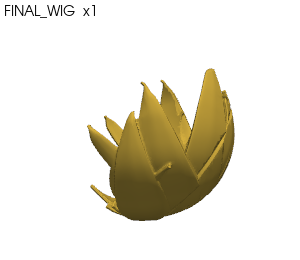</td>
   </tr> 
</table>

**(Twiglet)** `print/mods/Twiglet/wig_v3.44/FINAL_WIG.stl` (hair v3.44, variant c14) is one piece of yellow/blond PLA at 4.5 % lightning infill, 186.2 g, 243 × 246 × 240 mm as oriented (fits a P1S; crown axis tilted 38° from straight down for the least support, ~473 cm³ of support). Closed crown, walls ≥ 2.39 mm, watertight single body.

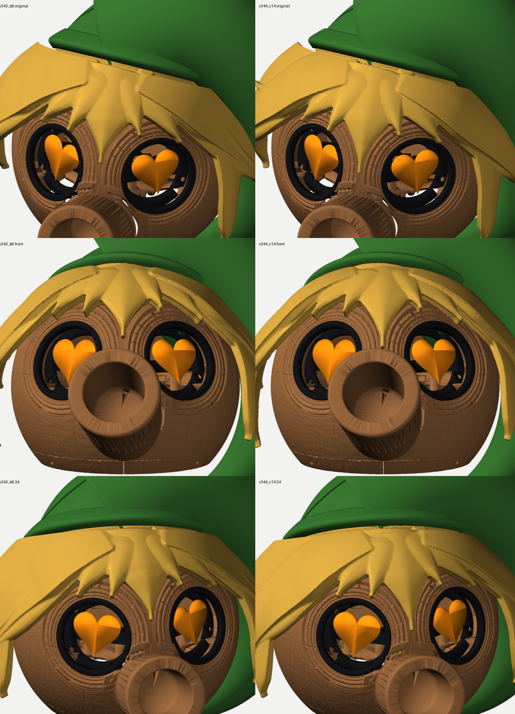

1. Glue the four 3 mm × 12 mm rods 5 mm deep into the 4 blind holes in the wig.
2. Dry-fit. The 7 mm rod ends drop into the 4 vertical 3.2 mm holes (7.5 mm deep) in `head_upper`. The keyed tongue only fits one way, with the long arc at the front.
3. Glue it with 2-part epoxy: a thin bead on the crown seat band, the tongue and the pin holes. Push it down and tape it for 1 h.
   - For a removable wig, use pins, tongue and 3 dots of E6000 or hot glue.
4. **Hat:** pull the felt hat on so its edge sits in the recessed band all the way round (the hat seat on the wig/head is an 8 mm smooth crown plus a 4.5 mm recessed band, v3.27): front edge just above the fringe roots, down over the left ear, tail flopping to the robot's left. The hat is not modelled in the renders or the sim (head v2 budgeted ~45 g of felt). TODO: whether the head v2 hat magnets / stitch holes still exist on v3.30.

### 15. Final checks

- Weigh the robot. The current sim model (`experiments/twiglet_sim/models/twiglet_v3_v334_wig344.xml`) assumes 2.753 kg in total, with the head at 0.814 kg including the ballast and the wig. TODO: compare with the real build.
- Move every joint by hand through its soft limits and check that nothing binds. The sim sweeps say the arms are clear of the shell, kilt and head, and the wig is clear of the arms inside the head soft limits ([experiments/README.md](../experiments/README.md)).

Et voila :) 

> Now that your duck is fully assembled, you setup the raspberry pi and the runtime software [here](https://github.com/apirrone/Open_Duck_Mini_Runtime). TODO: add the arm servos and the eyes to the runtime.

## Remaining TODOs (collected)

- Screw counts and lengths for the legs, trunk, arms and head halves; insert count total.
- Shin sheet and leg spacer quantities; whether `left/right_roll_to_pitch` are still printed; the other unused stock parts.
- Hip-cradle / trunk / leg fasteners; whether the stock trunk bearings are still used.
- Where the servo board, IMU, 6 V buck and Pi go; how the battery pod is held; an updated wiring diagram.
- Boot retention; kilt band fixing; PLA petal retention; torso shell fasteners and order vs the shoulder servos.
- Confirm the v3.30 head details taken from the head v2 / v3 notes (Pi mount, relocated board, roll-mount screws, bezel gluing, hat anchors).
- Arm servo IDs; foot switches; speaker.
